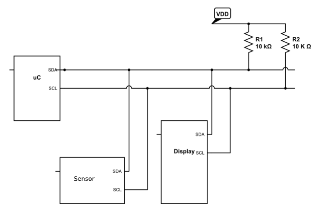
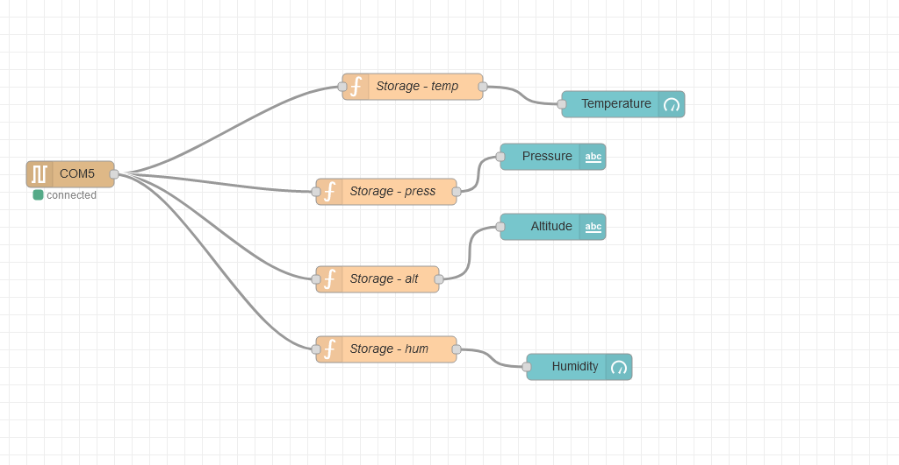

# VIN-Project: Weather station

An implementation for a simple weather station for our undergraduate I/O devices class.

## 1. Used components:

This project uses the following components:
- 1x Arduino UNO R3
- 1x Breadboard
- 1x LCD I2C display
- 1x BME/BMP280 sensor (I2C device)
- 12x jumper wires 

## 2. Circuit diagram

The main components should be wired together as following (ofcourse the implementation will vary, as the components differ.):
 

 
credits: [gbarry](https://electronics.stackexchange.com/questions/25278/how-to-connect-multiple-i2c-interface-devices-into-a-single-pin-a4-sda-and-a5)
 
 
This implementation is possible because all I2C devices have different addresses and thus can be connected to the same SDA/SCL ports in parallel.

## 3. Web dashboard

This project can also interface with a web dashboard implemented in Node-RED. The dashboard display the temperature and humidity as gauges, and approximate altitude and pressure as numerical values.

The flow for this dashboard looks as such:
 

 
Where the functions between the dashboard element and COM5 port take the input, extract only the value the dashboard element needs and send it off.
